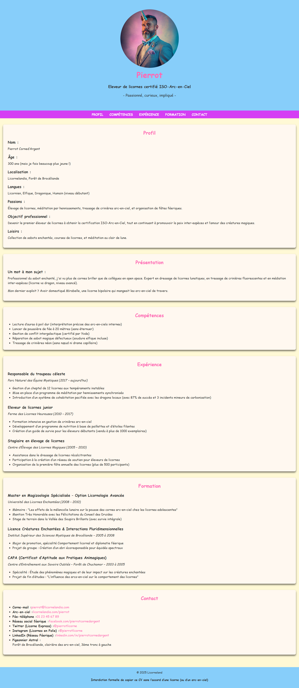

# 🦄 CV de Pierrot – Éleveur de Licornes Certifié ISO-Arc-en-Ciel

## 📜 Présentation

Bienvenue dans le CV en ligne (et enchanté) de **Pierrot Corned'Argent**, éleveur de licornes certifié, spécialiste en crinières arc-en-ciel, et médiateur féerique inter-espèces.

Ce projet a été créé dans le cadre d'une révision approfondie des fondamentaux **HTML5** et **CSS3**, avec une touche d'humour et de magie ✨.

## 🎯 Objectifs pédagogiques

- Revoir les balises HTML sémantiques (`header`, `main`, `section`, `article`, `footer`, etc.)
- Maîtriser la structuration logique d’une page web
- Pratiquer les bonnes pratiques d’accessibilité (attributs `alt`, rôles ARIA, contraste, etc.)
- Appliquer les fondamentaux CSS : box model, flexbox, responsive design
- Créer une mise en page claire, lisible et personnalisée

## 📦 Contenu du projet

- `index.html` : page unique structurée en sections (profil, compétences, expériences, formation, contact)
- `styles.css` : feuille de style complète avec un design responsive et coloré
- `README.md` : ce fichier de présentation

## 🧠 Notions HTML & CSS mobilisées

- Structure HTML5 complète avec balises sémantiques
- Navigation ancrée (`<nav>` avec liens internes)
- Accessibilité (`role`, `meta`, attributs `alt`, liens clairs)
- Responsive design avec media queries
- Mise en page fluide grâce à Flexbox
- Palette de couleurs personnalisée et ludique
- Utilisation de classes, d’ID, de sélecteurs d’attributs et pseudo-classes (`:hover`)

## 🧙 À propos du personnage

> Ce projet volontairement absurde et féerique est un prétexte créatif pour renforcer les compétences techniques tout en s'amusant.

Pierrot Corned’Argent est un personnage fictif et haut en couleurs, dont le CV mêle fantaisie, références geek et poésie magique.

## 📸 Aperçu visuel

## 🤝 Contributeurs/trices

Gabrielle Pagnard 🧑‍💻 - Créatrice du projet

## 📬 Contact

Pour toute question ou suggestion, n'hésitez pas à me contacter :   

Email : gpagnard@gmail.com   
GitHub : [GabriellePagnard](https://github.com/GabriellePagnard)     

 

Merci d'avoir pris le temps de découvrir le CV de Pierrot - Eleveur de licornes ! ⭐ 

Si vous aimez ce projet, n'hésitez pas à lui donner une étoile sur GitHub. Cela aide grandement à faire connaître le projet et à motiver son développement continu.